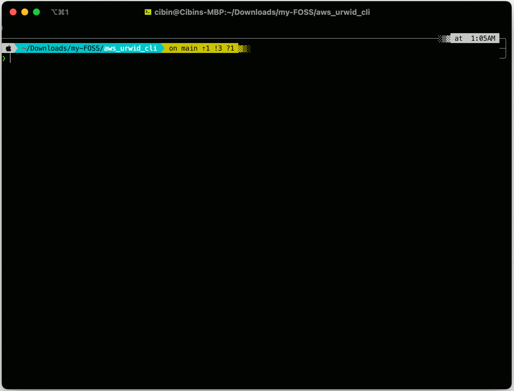
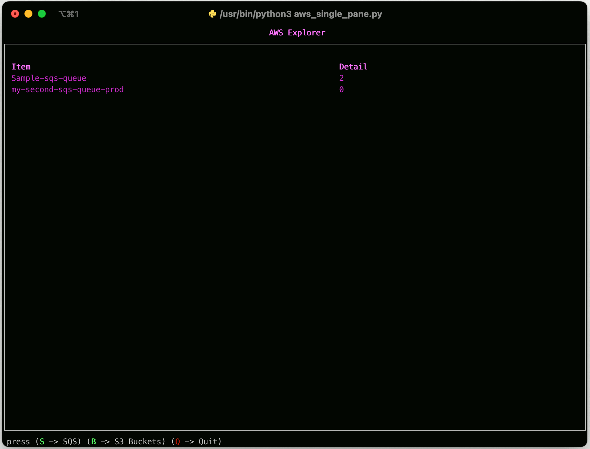

## CLI app to interact with AWS
> Simple urwid based cli to query and dispaly AWS resource details. Created as a tutorial.


- easily navigable with `vim keybindings` like single key shortcuts.
- uses [urwid](https://github.com/urwid/urwid) TUI library
- Fetches and displays some basic information about selected AWS resources.

Read the tutorial blog: [Building a cli app for AWS](https://medium.com/p/6ebbe9a3881e)

 
## Demo

### Dual Pane example


### Single Pane example



## Setup and Usage

Install the dependencies

`python3 -m pip install -r requirements.txt`

```bash
# Running the script

python3 aws_single_pane.py  # single pane example
python3 aws_dual_pane.py  # dual pane example
```
Press `s` to see `SQS queues`, `b` to list `buckets` & `q` to `quit` the app


## License

[MIT](LICENSE)
